% Cross-Cutting User Interface Requirements - Sample Specification
% Thomas Noetzold (tnoetzold@acm.org)
% 28-02-2009, revised 18-12-2013

# PREFACE

This document is a sample specification for the cross-cutting user interface requirements of a (fictitious) business information system.

Although the individual requirements have been inspired by a number of different applications, the general idea behind them is that of a largely data-driven application for some financial industry customer. I have tried to include as many requirements as possible because I think it will be easier to cut than to add, when re-using this document for a new project. The downside is that some requirements are not quite consistent.

Many requirements are fairly high-level and would need to be discussed and/or detailed before they could be implemented. Also, it would probably help to provide more illustrations or mock-ups.

This document is not intended to be written up front in a project. Instead, it should be used to collect and adapt cross-cutting requirements as they emerge.

This approach has proven itself useful in several projects in the recent years.

If you find problems, inconsistencies or errors, please help to improve this document, by posting an issue or pull request on [github](https://github.com/openreq/specblocks).

This document is licensed under a Creative Commons [Attribution-ShareAlike](http://creativecommons.org/licenses/by-sa/4.0/) 4.0 International [License](http://creativecommons.org/licenses/by-sa/4.0/legalcode).

# INTRODUCTION

## Objective
The purpose of this document is to define the cross-cutting requirements for the user interface elements that the application must provide.

We describe the cross-cutting requirements separately from the specific application requirements, such as individual screens and dialogues in order to:

- avoid redundancies,
- ensure consistency,
- make potential for re-use visible

across the entire application.

Also, this document defines the standard terminology to be used across all user interface descriptions.

## General Approach
An important principle, used in this document, is the separation of semantics (structure and behaviour) from presentation (layout and design) when describing user interface requirements.

As an example, consider a user interface element, which is to provide a choice between three options. This could be implemented, for example, as three radio buttons, a drop-down list or a regular list.

The effect for the application would be the same in all three implementations: The user is presented with a choice and picks one option. We will therefore simply describe this element as a choice, when describing a concrete screen. This allows us to defer or delegate the decision, which presentation exactly we will use. Also we can later change that decision without causing a structural change.

## Assumptions
The system supports multi-tenancy. Some features of the user interface will be configurable per tenant, as described below.

The UI will be made available as a stand-alone application for the operating systems supported and as a web application which runs in the supported browsers.

## Definitions (Glossary)
The following terms will be used to describe the user interface. The definitions are used later in this document to describe the requirements in detail.

Application
:   From a user’s perspective the application is a role-specific collection of screen flows, which may be started as a single application in the terms of the operating system or the browser that it runs on. It is represented by the desktop.

User Session
:   A user session starts when the user is authenticated and ends when the user is logged out or the application is terminated or times out. It is represented by the user session view.

Screen Flow
:   A screen flow is a collection of one or more screens and their associated behaviour. It is started by a command and represented by one or more workspaces.

Screen
:   A screen is a collection of controls or components. It may be split into two or more sections. A screen is displayed in a workspace.

Section
:   A section is a logical grouping of user interface elements on a screen. It is represented by a box, a shutter or a tab.

Desktop
:   The desktop is the main application window. It contains other elements such as a navigator, workspaces and a status bar and defines their layout.

Navigator
:   A navigator is an area displaying a hierarchical list of commands, which serve to select screen flows. A single command may open more than one workspace.

Workspace
:   A workspace is an area, where a screen flow may be displayed. The primary workspace displays the main currently active screen flow. The secondary and further workspaces display additional open screen flows.

Control
:   A control is a basic user interface element, such as a label, a field, a choice or a command. Each control may define any number of events which may in turn invoke an action.

Component
:   A Component is a complex user interface element composed of controls and/or other components. It may define its own events.

Action
:   An action is the implementation of behaviour such as making a service call to request or update data, performing a calculation or navigating somewhere else. Actions may be invoked by events. They may themselves raise events which represent the outcomes.

Command
:   A command is a user interface element with the only purpose to invoke an action. It may be represented as a button, a link or a menu item.

Event
:   The behaviour of the user interface is triggered by events. Controls, Components and Actions may all raise events. Each event may trigger an action, which implements the behaviour.

# CROSS-CUTTING USER INTERFACE REQUIREMENTS

This section describes the cross-cutting user interface requirements as they were distilled from the application requirements.

## Structure
The structure of the application is a simple hierarchy of elements, as described below.

### Application

From a user’s perspective the application is a collection of screen flows specific to a role (or combination of roles), which may be started in the standard way that the operating system provides (stand-alone application), or by following a hyperlink (web application).

The tenant can configure the packaging of screen flows into applications. The user’s roles may further restrict this selection. The application that the user sees will be configured to include all functionality relevant to her or his roles.

An application is represented by the desktop, which determines the layout of the application windows.

The application will prompt the user for confirmation before closing. Partially complete screen flows will also prompt for confirmation before closing. All prompts must be confirmed before the closing action is taken. If the user cancels any confirmation the entire closing action will be cancelled.

### User Session
At application start-up, a user session with the application is established. The user session starts when the user is authenticated and ends when the user is logged out or the application is terminated or times out.

An explicit login may or may not be required, depending on whether the user is authenticated by other means, such as some single sign-on solution, or not. Multiple concurrent sessions using the same user identification are not allowed within the same application. However, the user may have concurrent sessions in different applications.

A user session is represented by the user session view.

When a session is established, the user is presented with a choice of screen flows available to her or his roles. 

### Screen Flow
A screen flow is a collection of one or more screens and their associated behaviour, represented by a command in the navigator. Its behaviour is invoked by actions which are triggered by events on a screen.

Screen flows may be nested. There may be flows which are accessible only from a higher level flow. Flows may also contain no screen at all, but only actions.

The users may start one or more of the screen flows available to them (depending on their access rights and the current context) at any time. Each screen flow remains active until it ends or until the user session ends.

The available screen flows are presented as commands in the navigator. The screen flows may be grouped in a single list or under a hierarchy of headings. A single command may open more than one screen flow.

Screen flows may interact with each other. They may access common data held in the user session context. A screen flow may publish events which may trigger actions on another screen flow. A screen flow may interact with the desktop using a service interface provided by the desktop (see below).

The steps in a screen flow may be represented by a screen flow progress indicator, together with the information whether the steps are completed or not.

Multiple concurrent screen flows of the same type are allowed unless limited by configuration. 

A screen flow may call a second instance of itself as a sub-flow.

Every screen flow that calls an action which updates data needs to provide a summary screen, based on a validated request message. That screen may be displayed to the referee by a referrals screen flow.

A screen flow will prompt the user for confirmation before closing if it is in a modified or incomplete state.

### Screen
A screen is a collection of controls or components. It may be split into two or more sections. A screen is displayed in a workspace.

Commands on a screen are considered to relate to the whole screen. For example, a submit command on a screen will submit all data from every section of the screen to a service.

### Section
A section is a logical grouping of user interface elements on a screen.

If a screen has sections and there are commands defined as belonging to a section, these commands are considered to relate only to that section, not to the whole screen. For example, a recalculate command on a section may recalculate some value based on the data in that section, but the data is not submitted until the whole screen is submitted.

### Component
A Component is a complex user interface element composed of controls and/or other components.

### Control
A control is a basic user interface element, which is not decomposed further, such as a label, a field, a choice or a command.

## Presentation

### Desktop
The desktop represents the application and the user session. It is displayed in a standard operating system or browser window. The window title is the name of the application. The default layout is configured by the developer and is loaded when the application is started for the first time.

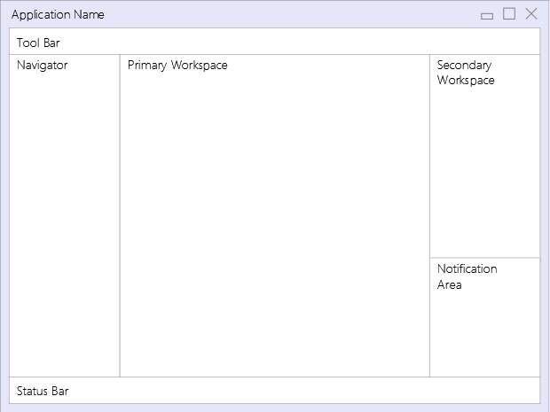

The desktop contains the following elements:

- Tool Bar
- Navigator
- Primary Workspace
- Secondary Workspace
- Notification Area
- Status Bar

The general layout of the desktop is fixed but the individual parts may be displayed or hidden. A component is provided, which allows the user to switch between different layouts rapidly.

As a default, the tool bar is displayed on the top. The navigator is displayed on the left. The primary workspace is displayed in the centre. The secondary workspace is displayed on the right with the notification area below. Additional workspaces may be displayed below the existing ones. A workspace may be moved by dragging it to a different position, where its layout may change. The status bar is displayed at the bottom.

If the desktop is configured so that the user can change the layout, that layout may be saved by the user from one user session to the next.

The desktop offers a service interface for all aspects of it that may be controlled by a screen flow.

#### Tool Bar
The tool bar displays the Desktop Layout Bar. Also, it displays an area, where a workspace may be dragged and dropped. There the workspace is represented as a command and the workspace is closed. Executing the command from the tool bar will subsequently open the workspace in its last position.

The tool bar may display a drop-down to select “tools”. These are common screen flows to be used in different contexts.

The tool bar may display the user session view component (see section on components).

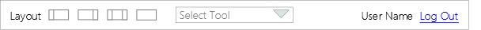

The tool bar will persist between sessions.

#### Navigator
The navigator is a window displaying a list or tree-view which serves to select a screen flow.

Screen flows may be enabled or disabled, dependent on any context data such as the status of connected systems, time of day, or country.

The navigator may display the screen flow shortcut component (see section on components).

For applications involving a large number of screen flows, a possibility to search, filter and sort the list or tree view is required. This feature may switched on or off by the user or by configuration.

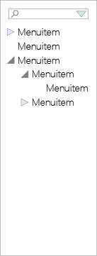

#### Primary workspace
The primary workspace is the central area of the desktop, where the main currently active screen flow is displayed.

#### Secondary and further workspaces
Secondary and further workspaces serve to display additional screen flows which run in parallel with the main screen flow or helper windows for things like an application-specific calculator.

#### Pop-up workspaces
From each workspace, a modal pop-up workspace may be opened, where a sub-flow of the original screen flow may be displayed. The pop-up workspace is modal to the workspace that created it. Work on the original workspace can continue only after the pop-up workspace is closed.

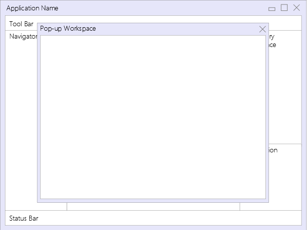

#### Notification area
The notification area serves to display the notification list at the bottom of the a secondary workspace.

#### Status bar
The status bar is an area to display status information relevant to the application. Examples include the status of connected systems and device status (printer online/offline/printing). A progress indicator, indicating the progress of the screen flow currently displayed in the primary workspace, may be displayed here. The status bar is displayed at the bottom of the main application window.

### Interaction between Workspaces
There may be dependencies between content displayed in different workspaces (primary, secondary and pop-up).

A screen flow may be defined to be displayed in any of the workspaces.

A screen flow which is defined to be displayed in the primary workspace may not be displayed in the secondary workspace; it may only be minimized and put on the toolbar.

If another primary screen flow is opened, while one is already open, it will minimize the already open screen flow currently displayed in the primary workspace and put it on the toolbar.

If a primary screen flow opens dependant sub-flows in the secondary workspace, these will be minimized together with the primary screen flow.

If a screen flow is displayed in the secondary workspace, which is opened independently from any primary screen flow, it will not be minimized together with the primary screen flow.

### Screen
The following default layouts may be applied to a screen: single space, one column or two columns. The commands on a screen that pertain to the whole screen are displayed on a clearly separated command bar.

#### Free format layout
The screen offers a single space where controls and components are displayed as they were manually positioned.

#### One column layout
Labels and fields are displayed in one column each.

#### Two columns layout
Labels and fields are displayed in two columns each.

#### Sections / Tabs
Every screen may be sectioned. Each section may have its own layout and commands. Sections are rectangular and fill the entire width of the screen.

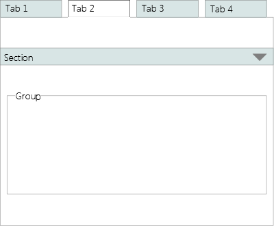

A Section is represented by a group (box), shutter or tab. Sections may not be nested.

### Fields
Per application, a default layout strategy may be defined for each field type. That strategy may take into account the field length defined in schema, as well as the screen layout and other factors. Individual screen layouts may override that strategy.

## Controls
Controls are user interface elements which may not be decomposed into further parts. They are described here according to their function, independent of presentation. Each control may define any number of events which may in turn invoke an action.

### Label
A label is a static text attached to any of the other elements or used stand-alone. Thus, a label may be attached to a single user interface element, a group of elements, or no other element at all. It may have a graphical representation associated with it, in which case only the graphic may be rendered and the label text may be displayed as tool tip. Both graphic and text are language dependent.

### Field
A field is a user interface element to display and/or edit data. Fields may be editable, read-only, mandatory, optional, or mandatory depending on a secondary attribute (for example, an employers address is mandatory if the customer is employed else not.)

A field may be visible or invisible, editable or read-only depending on context.

A field may depend on another field, which means that when the content of the primary field is changed, the content (and possibly the format) of the secondary field is changed also or the secondary field is displayed or hidden.

Cutting and pasting complete or partial field content within a field and from one field to another are supported.

#### Text
Text fields serve to display and/or edit character data. A system-wide maximum length may be configured to assure that database restrictions are met. In addition, a length and a number of lines for display (default is 1) may be defined for each text field.

Multi-line text fields support the use of Enter to get a new line rather than executing the default command for the screen.

Text fields support the display and (optionally) the input of all characters as represented within Unicode. This support depends upon the capabilities of the operating environment. Fields with different directions and character sets may be mixed on a single screen.

Text fields may be restricted to character sets such as the S.W.I.F.T. character sets (the S.W.I.F.T. character set, the EDIFACT level A character set (ISO 9735) and the S.W.I.F.T. extended character set / Information Service Character Set), upper case or lower case characters only, or other character sets. This must be specified by the underlying data schema.

On a text field, a property may be set, so that the characters are not displayed, but replacement symbols are displayed instead. One use is for the entry of a password.

#### Number
Numbers are displayed with the configured formatting for separators and decimal places, independent of input. Number formatting (for decimal places and separators) is locale-dependent. Lakh and crore numbering systems are supported.

#### Date
The Date Field supports locale-specific formatting.

#### Image
The Image Field serves to display an image in JPEG or PNG format.

### Choice
A choice is a user interface element which enables the user to make a selection from predefined options. Choices may be mandatory or optional. A default may be defined.

For large lists, a subset and a full set may be displayed. The subset is normally displayed. The user executes a command to call up the full set. The command is displayed below the last entry of the list (similar to the way additional menu items are made available in Microsoft Office). The subset includes the entries most recently chosen by the user. The maximum size of the subset is the same as the size (maximum visible lines) defined for the choice.

Drop-downs and Lists may have one or more columns. The content may vary depending on context.

A service will provide the list elements for all enumeration types. These may be cached by the application.

An entry of a drop-down may be selected by typing in enough letters (may be more than one) to make the search result unique, based on the entries in the first or only column.

A secondary choice may depend upon a primary choice in such a way that the values of the secondary choice change when a different entry is selected from the primary choice.

#### Boolean Choice
The boolean choice component provides a choice between two values (Yes/No, True/False). May be represented as Checkbox, Drop-down, List or Radio Button Group.

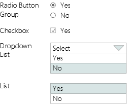

#### Single Choice
The single choice component provides a choice of one value from a list. An additional choice of “none” may optionally be provided. May be represented as Drop-down, List or Radio Button Group.

#### Multiple Choice
The multiple choice component provides a choice of multiple values from a list. Additional choices for “none” or “all” may optionally be provided. Optionally, one selection can be marked as "leading". May be represented as a table, list or check-box group.

### Command
A command is a user interface element with the only purpose to invoke an action. It may be represented as a button, a link or a menu item. The presentation may include text, an image or both. A locale-dependent shortcut may be defined for each command.

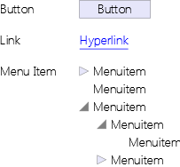

#### Button
As a rule, a button is used to represent the invocation of an action that changes data and/or navigates within the screen flow.

#### Link
As a rule, a link is used to represent the invocation of an action that navigates somewhere without changing any data.

#### Menu Item
As a rule, a menu item is used to represent the invocation of an action that starts one or more screen flows.

### Message Area
A message is an informational text with a category. Possible categories are Information, Warning, Error and Severe Error. A message area displays a message in a different format according to category. There is one message area per workspace. It is not visible when there are no messages to display.

### Group
A group is a collection of user interface elements (controls and/or components). It may be represented as a box with an optional label.

A group may be defined as non-breaking, so that elements will always be rendered together (in same column).

Groups may be nested.

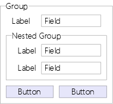

## Components
Components are user interface elements composed of controls and/or other components. They may define their own events. They are implemented by composing them from controls and adding behaviour and one or more pre-defined layouts.

### User Session View
The session view is a component which contains a read-only text field with the user’s name, an optional label indicating that the user is logged in and a logout command.

If no other authentication is provided, the login screen will be displayed before the desktop is displayed. The logout command will be issued when the desktop is closed. The user’s name may be displayed in the status bar or not displayed at all.

### Amount
The amount component is a number field with additional capabilities for input.

Input abbreviations are possible. The default abbreviations are:

    H - Hundreds
    T - Thousands
    M - Millions
    B - Billions

It is possible to enter both input abbreviations and decimal places. For example 1H.34 may be entered to represent 100.34.

It is possible, but not necessary, to enter separators.

If decimal places are configured, but not entered, they are assumed to be zero.

Decimal places may be entered as fractions, so for example twelve and three quarters can be entered as either:

    12.75 or
    12 3/4

Any fractions are supported.

The characters allowed as input abbreviations are locale-dependent.

### Currency Amount
A currency amount component consists of an amount and a two-column choice for currency. Formatting may change according to selected currency. (Example formats: 0 JPY, 0.00 GBP). Formatting  must cater for countries with massive inflation.

The data for the two column currency choice (Currency abbreviation and localized name) is provided by a service. (See Choice description above.)

Amount and currency are accessible separately so that they may be bound to different complex currency amount types in the service. (In some of those the currency is a simple value and in some it is based on an enumeration type.)

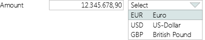

### Partner ID
The Partner ID component provides a collection of alternative input formats for Partner IDs. Each input format is a group of fields. The input format is toggled by a command. The component is functionally equivalent to a component which would display all the different input formats at once without the possibility to switch between them. Each input format may be bound to a separate simple or complex type. The component may only be bound to a service which supports all formats.

### Account
The account component provides a collection of alternative input formats for account numbers, such as IBAN, bank account number or credit card number. Each input format is a group of fields. Input format is toggled by a command. The component is functionally equivalent to a component which would display all the different input formats at once without the possibility to switch between them. Each input format may be bound to a separate simple or complex type. The component may only be bound to a service which supports all formats.

### Date
The date component allows the user to enter a date in abbreviated form which will be converted to a regular date. Default is current date, if left blank.

The default input abbreviations are:

    D - Days
    W - Weeks
    M - Months
    Y - Years
    T - Tomorrow

Examples of valid input abbreviations are:

    2D - Two days
    6M - Six months
    1Y - One year

The meaning of the input abbreviations may be different per tenant, per business process and per location.

Date formatting and the characters allowed as input abbreviations are locale-dependent.

### Frequency
The Frequency component consists of two choices, one to select a period and one to select one or more month(s), and a number field to enter a day number. The month choice is only enabled when periods quarterly, half yearly or yearly are selected. The day number field is not enabled when period daily is selected. The day numbers must be in the range of 1 to 31 except where stated otherwise in the table below.

Period       Month(s)         Day number range
------------ ---------------- -----------------------------------------
Yearly       Jan              01-31
             ...               
             Dec              01-31
Half yearly  Jan+Jul          01-31
             Feb+Aug          01-31
             Mar+Sep          01-31
             Apr+Oct          01-31
             May+Nov          01-31
             Jun+Dec          01-31
Quarterly    Jan+Apr+Jul+Oct  01-31
             Feb+May+Aug+Nov  01-31
             Mar+Jun+Sep+Dec  01-31
Monthly                       01-31
Weekly                        01-07 (Monday to Sunday)
Fortnightly                   01-14 (08 is Monday in the second week)
Daily                         No day number is required

Table: Frequencies

### Table View
The table view is a component to view tabular data.

It provides configurable pagination for large result sets.

Sorting and filtering may be done locally or by the service provider sourcing the data, in which case the criteria will be passed to the service. If done locally, sorting and filtering is based on the data as it was provided by the service. There is no default mechanism to retrieve paged data.

The table may be sorted locally by any column. The sort order may be reset and saved. The sort order for text is locale-dependent. A column which contains characters from more than one character set (for example Arabic and Latin) can only be sorted in Unicode sort order by this component. If other sort orders for such columns are required, they must be provided by the service provider.

The table may be filtered locally by any column. In order to support this, a Table View may contain an additional collapsible filter row between header and content. This row contains an editable text field for each column where the user may enter filter expressions. With each character that the user enters, the table is restricted to the rows matching the filter. Valid filter expressions are:

-------------------------------------------------------------------------------------------------------------------------------
Filter                            Result
--------------------------------- ---------------------------------------------------------------------------------------------
text or text\*                    Rows where column contents starts with text

\* or blank                       All Rows

\*text or \*text*                 Rows where column content contains text at any position 

\<text, \>text, \<=text, \>=text  Rows where column content is higher or lower than text

\=text                            Rows where column content exactly matches text

\?text, (\???text)                Rows where column content starting at the second position (fourth position) starts with text
-------------------------------------------------------------------------------------------------------------------------------

Table: Table Filters

The user may enter more than one filter expression separated by blanks, in which case the effects are combined (logical AND). Filters may be reset and saved.

Cells may contain fields, choices or commands. Commands in a row will act on, or use as context, the data contained in that row. Commands in a table may be represented as data that is displayed as hyperlink.

Option 1: Running Totals Column, with optional grand total field.

Option 2: Counter Column.

Option 3: The collection of visible commands on a screen or section may change depending on the content of a selected data item/row.

### Table Editor
The table editor component serves to insert, update and delete tabular data on a single screen.

The component offers a means to select a row (by cursor, link or with a radio button in front of every row).

The user may edit each cell by selecting it. The component raises events that indicate when a user begins editing a row and when he or she changes the current row.

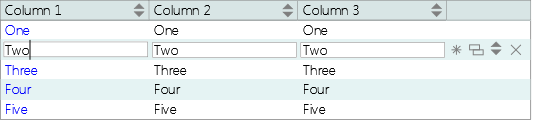

The component offers the following commands:

- Delete: raises a delete event, so that a service may delete the data. Deletes the currently selected row.
- New: inserts a new row below the currently selected row or at the end of the table, if no row is selected.
- Copy: copies the currently selected row into a new row below the selected row.
- Up/Down: raises a move event, so that a service may interpret this as a change in order. Moves a row up or down in the table. 

### Tree Table View
The Tree Table View is a Table View where the elements in the first column are indented according to their level in a hierarchy. Icons indicate whether a level in the hierarchy has items below it. Clicking on those icons expands or collapses the rows on the lower level.

The Tree Table View may be used as a tree view if it has only one column.

### Tree Table Editor
The Tree Table Editor is a Table Editor where the elements in the first column are indented according to their level in a hierarchy. Plus and minus icons indicate whether a level in the hierarchy has items below it. Clicking on those icons expands or collapses the rows on the lower level.

The Tree Table Editor provides commands to change the level in the hierarchy of an item.

### Message Box
The message box component consists of a read-only text field with a label indicating the category of the message (4 categories). Depending on the category, the applicable commands (OK, Ignore, Abort, Retry, Cancel) are provided.

Messages may contain a link to a screen flow.

The component provides an optional boolean choice to confirm that the message has been read. 

The component provides an optional timer to close the message box after a configured amount of time has elapsed.

### Notification List
The notification list is a table view to display notifications. Default sort order is latest first. User may sort by any column.

### Notification
The notification component serves to notify the user of an event. Notifications come in three priorities:

- Priority 1 – Notifications are displayed as a pop up, 
- Priority 2 – Notifications are indicated, even if the notification list is hidden, 
- Priority 3 – Notifications are displayed on notification list only.

Priority 1 notifications are displayed as popup but don’t take the focus, so that a user may finish his or her current work without interruption. Notifications may contain a link to a screen flow.

### Calendar
The calendar component displays a locale-dependent calendar. It may be attached to a date field. The user may pick a date which is entered into the date field the calendar is attached to when the calendar is closed. Business days may be shown in a different design. Different business day calendars may be configured and used dependent on any context data, such as locale, group of branches or currency.

### Calculator
The calculator component provides a locale-dependent calculator/adding machine. It may be attached to a number field (which may be part of a currency amount control). It is represented by a command, which opens the calculator, where the user may calculate an amount. When the user closes the calculator, the calculated amount is entered into the field the calculator is attached to.

### Search Criteria Editor
The Search Criteria Editor component consists of search criteria entry fields and commands to start the search and to reset the criteria. It displays the search results in a Search Result List. Search Criteria may be defined by tenant. Search criteria syntax will be defined by the search service.

The search criteria entry fields are a variable length list of fields which must match the search service request message. If fields are optional in the search service request message, they need not be defined in the screen either. A tenant customizable search will be implemented in such a way that a service with a large number of (optional) search criteria is provided and the ones actually used are defined in a configuration file per tenant. Additional fields are implemented using the mechanisms defined for augmented data.

In text fields the user may enter search criteria using wildcards, where the \* character represents one or more characters and the \? character represents a single character. The wildcard characters may be different for different locales.

### Selection List
The Selection List component is a Table View with a Selection Bar (see section on Default Command Bars).

List columns may be defined by tenant using the same mechanism described above for the search criteria.

One or multiple rows may be selected at a time. When multiple rows are selected and a command is issued, the screen flow or sub flow triggered by that command is repeated once for each row selected.

### Detail View
The Detail View component provides a view for a single data item. Fields may be defined by tenant using the same mechanism described above for the search criteria.

### Detail Editor
The Detail Editor component provides an editor for a single data item. Fields may be defined by tenant using the same mechanism described above for the search criteria.

### Default Command Bars
Several command bars are provided as components to support standard screen flow behaviour as defined by Screen Flow Patterns.

#### Cancel Bar
- Cancel: Closes the current screen and returns to the previous one.

#### Confirmation Bar
- Cancel: Sends a cancel event to the currently running action, if the action is marked as cancellable.
- Submit: Calls the service submit operation and moves on to the next screen, if there is one.

#### View Bar
- Cancel: Closes the current screen and returns to the previous one.
- Edit, Opens Detail Editor with data currently displayed.
- New: Creates new data item of the type currently displayed, opens Detail Editor.
- Copy: Creates a copy of the currently displayed data item, opens Detail Editor.
- Delete: Deletes currently displayed data item, after confirmation.

#### Selection Bar
- View: Opens Detail View with data from selected row.
- Edit: Opens Detail Editor with data from selected row.
- New: Creates new data item, opens Detail Editor.
- Copy: Creates a copy of the selected data item, opens Detail Editor.
- Delete: Deletes selected data item, after confirmation.

#### Edit Bar
- Previous: Goes to the previous screen.
- Next: Goes to the next screen, defined as the default transition.
- Previous and Next are only enabled if the previous and next screens can be clearly determined from the screen flow.
- Cancel: Sends a cancel event to the currently running action, if the action is marked as cancellable.
- Close: Closes the screen flow, with the resulting behaviour optionally configured to prompt or not to prompt the user or to invoke custom code.
- Reset: Resets all editable fields to their default value.
- Verify: Verifies the data entered by calling the service validation operation (if any).
- Submit. Calls the service submit operation and moves on to the next screen, if there is one.
- Submit and Next are disabled unless data has been entered into all mandatory fields.

### Screen Flow Progress View
The Screen Flow Progress View component shows the progress made in a screen flow. It may be represented as a progress indicator, a step list or a step bar.

#### Progress indicator
Graphical representation of percentage of steps completed.

#### Step List
List of steps with optional check box to mark completion. Steps may optionally be navigable.

#### Step Bar
Array of numbered labels with different style for completed, current and open steps. Steps may optionally be navigable.

### Many-from-many Selection
The Many-from-many Selection component provides two list boxes, one with values to choose from, one with values chosen, and commands to move selected values in both directions and to save selection.

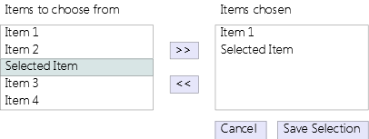

### Configuration Editor
The Configuration Editor component serves to edit configuration data. Configuration data is defined as name/value pairs where the values are editable. The name/value pairs may be organized in groups.

### Screen Flow Shortcut
The Screen Flow Shortcut component lets the user address a screen flow directly by entering a locale-specific mnemonic function code into an edit field or search for a screen flow. The search supports wildcards as defined for the Search Criteria Editor.

This component may be integrated into the navigator or displayed on the toolbar.

### Augmented Data View and Editor
The Augmented Data View and Editor is a component to display and edit augmented data as defined by the tenant. This component supports the extensibility requirement.

Some services will provide the capability to define additional fields per tenant. These will be defined per object. The definition includes a name, a type description, a length, a label (per locale), a validation rule and a content description (per locale). A service will be provided to support the configuration and retrieval of the definitions of all augmented data fields. The Augmented Data View and Editor component displays and provides the editing capability for this data. For each supported field type a control matching its type definition is provided.

### Graph View
The Graph View component serves to display tabular data in a variety of graphical formats (bar chart, pie chart, line diagram etc.)

### Image View
The Image View component allows to display, rotate, scale and invert an image. Supported formats are JPEG and PNG.

### Help Browser
The Help Browser Component display help in HTML format. It is composed of a tree view showing help topics with a linked text field, showing the help text.

Help texts may exist in different languages and the component will select the correct translation based on the user’s preferred language.

Context-specific help may be linked to the following elements: control, component, screen, screen-flow and application.

### Desktop Layout Bar
The Desktop Layout Bar component allows the user to switch between different desktop layouts rapidly. The bar includes four commands which each represent a standard Desktop layout:

1. Navigation, primary workspace and secondary workspace.
2. Navigation and primary workspace.
3. Primary workspace and secondary workspace.
4. Primary workspace only.

### Desktop Configuration Editor
The Desktop Configuration Editor component lets the user edit the user-configurable layout properties of desktop and workspaces, namely font sizes, colours and whether sections in a workspace are displayed as sections or tabs. The user may save these settings for the desktop and per workspace.

### Value Selector
The Value Selector component lets the user select the value for a field from a list. It consists of a field and a command which opens a multi-column drop down list for value selection. One column is bound to the field. The search is dynamic i.e. based on a service. It is not a pre-defined list of values.

The Value Selector component may be used as an alternative to the value selection screen flow pattern when only one search criterion is required.

## Binding
Each control or component may be bound to a data item from the object model.

## Validation
Validation may relate to a single field or a validation group.

Minimal schema-based validation is always performed.

Simple additional validation may be defined by the developer by selecting a pre-defined validation.

Complex validation is defined in the underlying service, based on screen, component, validation group or field and accessed via a service call. If field related error messages from a service call are to be displayed, they must be provided in a list in the response, each message and/or message code together with an expression describing the field in the request message that it relates to. If field-specific errors are provided, the fields that caused an error may be highlighted and the error text may be displayed next to them (depending on layout).

## Internationalization
The following features are required:

- Unicode character set.
- International date and time formats.
- International and currency-dependent number formats including lakhs and crores.
- Right-to-left edit fields and right-to-left screen layout support, specifically for Arabic. Note that text-fields need to be bi-directional for this, because both directions may be displayed / edited in the same field.
- Chinese, Japanese and Korean language support, left to right only.

## Printing
Using a general Print Screen command the content of each individual screen may be printed. This may be disabled for certain screens such as those showing a client signature.

## Miscellaneous

### Tab-Sequence
The Tab-sequence may be configured by the developer. It may be the default sequence, which is left to right/top-down or right to left/top-down, depending on screen direction, or a numbered sequence.

### Short-Cuts
Short-Cuts may be configured by the developer. One letter of the command label serves as shortcut-key (Alt-letter), alternatively a function-key may be defined for the same purpose. Short-Cuts are language-dependent. One command per screen is the default command, which is executed when the user presses Enter.

### Tool Tips
Each control and component may have a language-dependent tool tip associated with it, which is displayed when the mouse pointer hovers over an area distinctly representing the element.

### Branding
The tenant may change the look and feel of the application by configuring the following elements:

- optional Splash screen,
- title of application,
- any property defined in style sheet.

# USER INTERFACE PATTERNS

## Screen Patterns
This section lists some common screen patterns. They are used below in describing common screen flow patterns.

### Search Screen
Combination of a Search Criteria Editor and a Selection List showing the results of the search.

### Master/Detail Screen
Combination of a Detail View or Detail Editor with an attached list of dependent data items, displayed as a Table View (read-only) or Selection List (editable).

### Dashboard
Combination of a Detail View or Detail Editor with multiple attached lists of dependent data items, displayed as Selection Lists.

### List/Detail Screen
Combination of a Selection List and an attached Detail View or Detail Editor showing the details of the item currently selected. Commands to add a new item to the list, copy an existing one and to edit the currently selected one. 

## Screen Flow Patterns
This sections lists the most common screen flow patterns we have encountered. They use the screens listed above.

### Basic Inquiry / Edit
Implements a basic inquiry/edit flow which consists of a Search Screen and a basic View/Edit screen flow. Includes a Detail View Screen, a Detail Editor Screen, an optional Referrals Screen and a Confirm Delete Screen with commands/actions to view, edit, copy, delete and add a new data item.

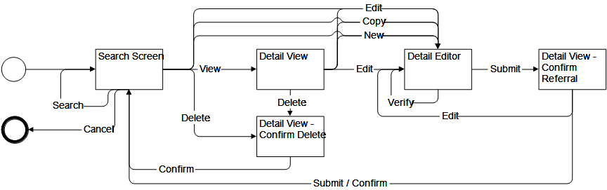

### Detail View
Screen flow including a single Detail View Screen. Most basic screen flow. May be used as sub-flow or to display data accessible directly from the context.

### Detail View/Edit
Basic View/Edit screen flow. Includes a Detail View Screen, a Detail Editor Screen, an optional Referrals Screen and a Confirm Delete Screen with commands/actions to view, edit, copy, delete and add a new data item.

### Selection List
Implements a basic inquiry/edit flow which consists of a Selection List and an optional Search Criteria Editor on one screen and a Detail View/Edit sub-flow as described above.

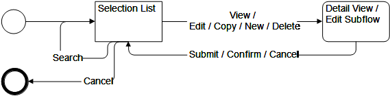

### Basic Inquiry / Edit Variant
Implements a variant of the basic inquiry/edit flow which has the Selection List and the Search Criteria Editor on separate screens plus a Detail View/Edit sub-flow as described above.

### Basic Drill-Down
Contains a Detail View or Editor which includes one or more Selection Lists, which may be connected to other Detail Views/Editors, which again may contain Selection Lists and so on.

### Multi-Step Edit Flow
Screen flow where a sequence of screens, connected by next and previous commands, serves to edit a data item. Could also be represented by a single Edit View Screen with sections, but then the sequence would not be pre-defined. A confirmation screen at the end of the screen flow links back to each edit screen in the sequence.

### Value Selection
Screen flow to select a single value from a selection list, displayed on a different screen.

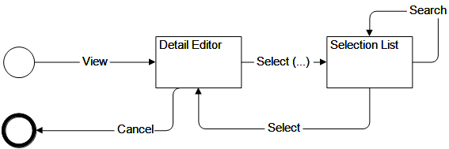

### Detail Selection
Screen flow with a selection list on one screen where each row is linked to a detail view on another screen.

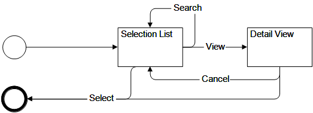

# COMMON USE CASES
This section describes some common use cases, which are largely independent of specific functional requirements. They are thus good candidates for implementation by a framework.

## Application start-up

### Description
The application starts and determines if the user needs to be authenticated.

### Basic Flow
1) The use case starts when the user double-clicks the icon that represents the application or chooses the entry for the application from the start-menu.

2) Upon start-up the client connects to the server.

3) The system determines whether the user needs to be authenticated.

4) If the user needs to be authenticated, the system determines the authentication procedure required for the application and calls it. If the user needs to be logged in, the system calls the login use case.

5) The use case ends.

### Alternative Flows
2a) If the client cannot connect to the server, an error message is displayed. The user is offered the choice to retry or terminate the application. If the user chooses to retry, the client tries again to connect to the server. If the user chooses to terminate the application the use case ends.

4a) If the user does not need to be authenticated, the Establish User Session use case is called with the option to establish a guest session.

## Login

### Description
The user logs in to the application.

### Basic Flow
1) The system starts the use case if it determines that a user is not authenticated and a login is required.

2) The system prompts the user to enter the following data required for log in and provides options to log in, cancel or change the password:

- User Name
- Password

3) The user enters her or his user name and password and issues the login command.

4) The system authenticates the user.

5) The use case ends with the outcome “success”.

### Alternative Flows
3a) If the user chooses to cancel, the use case ends with the outcome “cancelled”.

3b) If the user chooses change her or his password, the use case Change Password is called.

4a) If the system can not authenticate the user, it returns an error message, which gives the reason for the failure. The user is given the choice to retry or abort the use case. If the user chooses to retry, the system prompts again for the log-in data. If the user chooses to abort, the use case ends with the outcome “failure”.

## Change Password

### Description
The user changes her or his password.

### Basic Flow
1) The use case starts when the user chooses to change her or his password in the Login use case.

2) The system prompts the user to enter the following data required to change the password:

- Old Password
- New Password
- New Password Confirmation

3) The system tries to verify the old password and checks if the entries in the New Password and New Password Confirmation fields are the same.

4) If the verification is successful, the system saves the new password to permanent storage.

5) The use case ends with the outcome “success”.

### Alternative Flows
4a) If the system can not verify the old password, or the entries in the New Password and New Password Confirmation fields are not the same, the system displays the error and offers the user to retry or abort the use case. If the user chooses to retry, the Change Password screen is displayed again. If the user chooses to abort, the use case ends with the outcome “failure”.

## Establish user session

### Description
A user session is started, the user’s roles are determined and the navigator is configured.

### Basic Flow
1) The use case starts after the user has been authenticated.

2) The system starts the user session.

3) The system determines the user’s role or collection of roles. It looks up the screen flows defined for each role and it builds the navigator accordingly.

4) The user picks a screen flow to be started.

5) The system starts the screen flow.

6) The use case ends when the user logs out.

### Alternative Flows
3a) If only one screen flow is configured for the user, that screen flow is started and no navigator is built.

5a) If a screen flow cannot be started, the error is displayed and the user is given the choice to retry starting the screen flow or abort. If the user aborts, the screen flow is not started.

6a) If the application terminates due to an error, the error is displayed and the user is given the choice to restart the application. The use case ends.

# APPENDIX: REQUIREMENTS PRIORITIES

This section provides a list of the requirements and their priority as seen by the business.

Priorities are:

- Priority 1 - Cannot deliver the application without it.
- Priority 2 - Cannot deliver parts of the application without it.
- Priority 3 - Advantageous, but the first version of the application can be delivered without it.

Requirement Name             Requirement Description           Priority
---------------------------- --------------------------------- ---------
Basic Structure              Basic structural elements of UI   1  
Controls                     Basic user interface elements     1  
*Components*                                                      
User Session View                                              1  
Amount                                                         1  
Currency Amount                                                1  
Partner ID                                                     1  
Account                                                        1  
Date                                                           2  
Frequency                                                      2  
Table View                                                     1  
Table View Filter                                              2  
Table View Options           Running Totals, Counter           2  
Expandable Table Editor                                        2  
Tree Table                                                     2  
Message Box                                                    1  
Notification Component                                         1  
Calendar Component                                             2  
Calculator Component                                           3  
Search Criteria Editor                                         2  
Selection List                                                 2  
Detail View                                                    2  
Detail Editor                                                  2  
Default Command Bars                                           2  
Screen Flow Progress View                                      1  
Many-from-many Selection                                       2  
Configuration Editor                                           2  
Screen Flow Shortcut                                           1  
Augmented Data View / Editor                                   2  
Graph View                                                     3  
Image View                                                     1  
Help Browser                                                   2/3
Desktop Layout Bar                                             3  
Desktop Configuration Editor                                   3  
*Miscellaneous*                                                   
Tab-Sequence                 Tab-Sequence configurable         1  
Short-Cuts                   Short-Cuts configurable           1  
Tool Tips                                                      3  
Branding                                                       1  
Binding                                                        1  
Validation                                                     1  
Internationalization                                           1  
Printing                                                       2  
*Screen Patterns*                                                 
Search Screen                                                  3  
Master/Detail Screen                                           3  
Dashboard                                                      3  
List/Detail Screen                                             3  

Table: Requirements list with priorities

